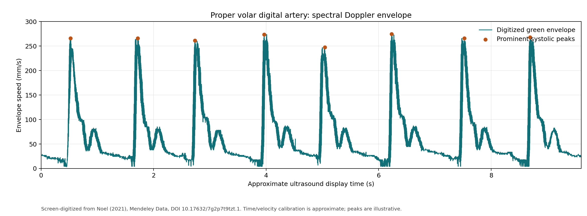
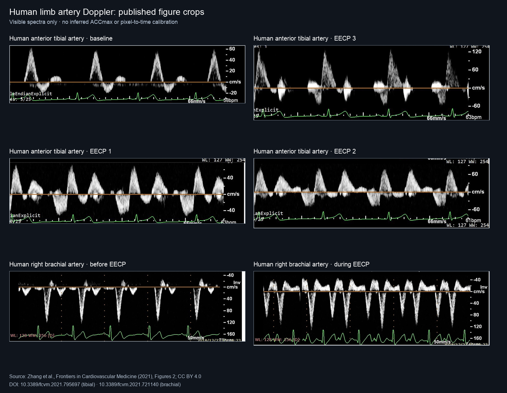

# Human limb artery Doppler examples for ACCmax algorithms

Public arterial Doppler material from human limbs, with plots and reproducible processing scripts for exploring automatic maximal systolic acceleration (ACCmax) measurement.

The full source video is attached to the repository's [`datasets-v1` release](https://github.com/mncavieres/ACCmax/releases/tag/datasets-v1). Smaller published figures, their spectral crops, plots, checksums, and provenance are tracked in Git.

| Source | Included material | Best use |
| --- | --- | --- |
| [Human finger artery, Mendeley Data](https://doi.org/10.17632/7g2p7t9tzt.1) | One ~10-second pulsed-wave Doppler video, an approximate digitized envelope, and two plots | Development on a continuous recording |
| [Human anterior tibial artery, Zhang et al.](https://doi.org/10.3389/fcvm.2021.795697) | Four spectral-image crops: baseline and three counterpulsation settings | Visual envelope and beat-detection checks |
| [Human brachial artery, Zhang et al.](https://doi.org/10.3389/fcvm.2021.721140) | Two pulsed-wave spectral-image crops: before and during counterpulsation | Visual checks with an inverted display |

ACCmax is the steepest slope of the systolic velocity upstroke. A physically meaningful result in m/s² requires verified velocity and time calibration, with attention to Doppler sign and angle correction. The published figure crops lack independently verified pixel-to-time calibration, and none of these sources provide expert ACCmax labels or a clinical peripheral arterial disease validation cohort.

The original materials are credited under their [CC BY 4.0](https://creativecommons.org/licenses/by/4.0/) licenses. See the [video provenance and checksum](data/README.md), [figure provenance and panel map](figures/README.md), and [video plot reproduction instructions](scripts/README.md).

For Claude working on ACCmax extraction, start with the [real data case guide](CLAUDE.md).

