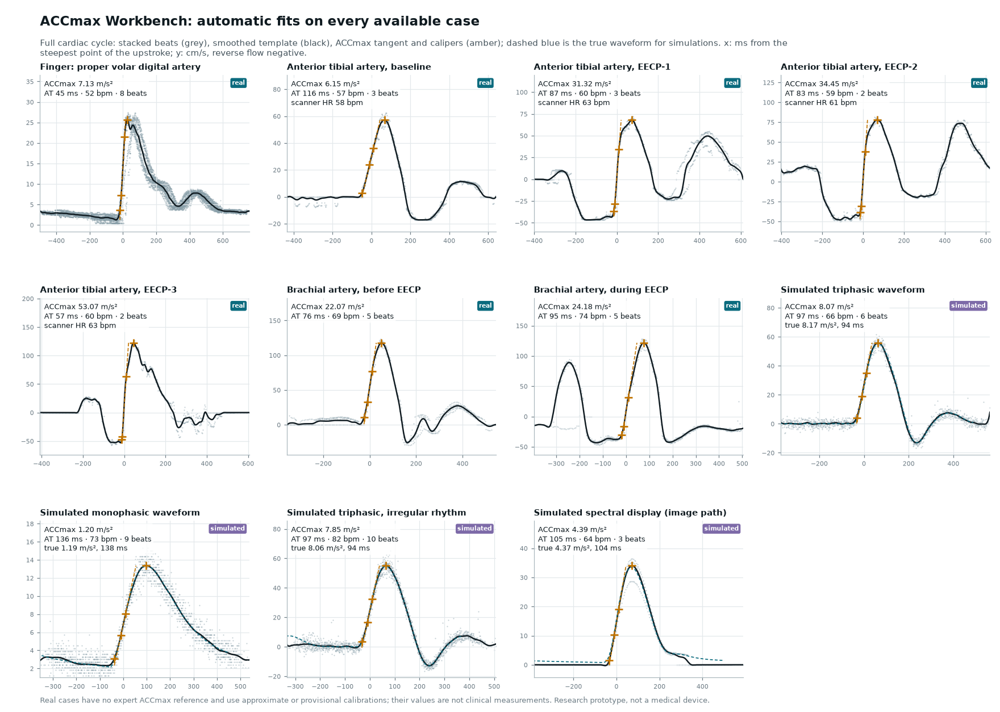

# Automatic fits on every available case

Every case below was fitted by the ACCmax Workbench algorithm with **no manual input**: for images the software read the calibration from the scanner overlay (velocity scale labels, baseline, time marks), exactly as the workbench does when the image is opened; it then traced the envelope, found the heart rate and every upstroke, aligned and stacked the beats over the full cardiac cycle, and placed the calipers. The same default settings were used for all cases (20 ms tangent span, tangent-intersection onset). Reverse flow is part of the fit, as negative velocity.



<!-- table:start -->
| Case | Data | Heart rate (scanner) | Beats used | ACCmax, m/s² (68% interval) | AT, ms (68% interval) | PSV, cm/s | Checkplot |
| --- | --- | --- | --- | --- | --- | --- | --- |
| Finger: proper volar digital artery | real | 52 | 8 of 9 | 7.13 (6.78–7.50) | 45 (42–47) | 26 | [png](checkplots/finger.png) |
| Anterior tibial artery, baseline | real | 57 (58) | 3 of 4 | 6.15 (5.78–6.60) | 116 (113–118) | 57 | [png](checkplots/anterior_tibial_baseline.png) |
| Anterior tibial artery, EECP-1 | real | 60 (63) | 3 of 4 | 31.32 (30.44–32.16) | 87 (84–91) | 68 | [png](checkplots/anterior_tibial_eecp_1.png) |
| Anterior tibial artery, EECP-2 | real | 59 (61) | 2 of 4 | 34.45 | 83 | 78 | [png](checkplots/anterior_tibial_eecp_2.png) |
| Anterior tibial artery, EECP-3 | real | 60 (63) | 2 of 4 | 53.07 | 57 | 122 | [png](checkplots/anterior_tibial_eecp_3.png) |
| Brachial artery, before EECP | real | 69 | 5 of 5 | 22.07 (21.30–22.93) | 76 (75–76) | 118 | [png](checkplots/brachial_before_eecp.png) |
| Brachial artery, during EECP | real | 74 | 5 of 6 | 24.18 (22.53–25.57) | 95 (94–98) | 122 | [png](checkplots/brachial_during_eecp.png) |
| Simulated triphasic waveform | simulated | 66 | 6 of 7 | 8.07 (7.56–8.59); true 8.17 | 97 (93–99); true 94 | 56 | [png](checkplots/sim_triphasic.png) |
| Simulated monophasic waveform | simulated | 73 | 9 of 11 | 1.20 (1.16–1.24); true 1.19 | 136 (130–142); true 138 | 13 | [png](checkplots/sim_monophasic.png) |
| Simulated triphasic, irregular rhythm | simulated | 82 | 10 of 12 | 7.85 (7.70–8.05); true 8.06 | 97 (95–100); true 94 | 55 | [png](checkplots/sim_irregular.png) |
| Simulated spectral display (image path) | simulated | 64 | 3 of 5 | 4.39 (3.97–4.91); true 4.37 | 105 (105–106); true 104 | 34 | [png](checkplots/sim_screen.png) |
<!-- table:end -->

Heart rate in brackets is the rate printed on the scanner screen, where legible. Image cases are also reported in display units in their checkplots (velocity pixels per time pixel), which do not depend on the calibration.

## How to read a checkplot

Each `checkplots/<case>.png` has four parts:

- **A, data.** The spectral image with what the automatic calibration read (yellow: scale ticks and the label values read; pink: time marks or grid lines; dashed boxes: the display region and the ignored ECG), the traced forward edge (amber) and reverse-flow edge (blue); or the velocity trace for numeric data. The fit uses both, as one signed trace. Triangles mark each detected systolic upstroke; grey ones were left out (incomplete at the edge of the image, or too dissimilar to the others).
- **B, stacked beats.** All accepted beats aligned on their upstroke over the full cardiac cycle, the smoothed template, and the automatic calipers: valley (diamond), onset, ACCmax points 1 and 2 with the tangent, and peak, with the AT bracket. For simulations the dashed blue line is the true waveform.
- **C, result.** ACCmax and AT with 68% intervals (beat bootstrap), heart rate, peak systolic and end-diastolic velocity, beats used, calibration (with its difference from the reference calibration in `figures/calibration.json`) and quality notes. Image cases also show the value measured on the forward edge alone (reverse flow set to zero). Simulations also show the true values and the error.
- **D, diagnostics.** The periodogram used to find the heart rate, beat-to-beat timing (O − C), and each single beat's ACCmax and AT against the stacked value.

## What each case shows, and its limits

None of the real sources comes with expert ACCmax measurements, so the real cases show that the method **runs end to end on real recordings and places sensible calipers**; they are not an accuracy study. Accuracy is shown on the simulations, where the truth is known (see also the Monte Carlo results in [docs/PLAN.md](../docs/PLAN.md)).

- **Simulations (4 cases).** ACCmax within 3% and AT within 3 ms of the truth, including an irregular (AF-like) rhythm and a rendered scanner display measured through the image path, calibrated automatically from its scale and timeline (0.250 cm/s and 4.499 ms per pixel read, against 0.250 and 4.500 true).
- **Anterior tibial artery, baseline.** The most relevant real case: a healthy resting triphasic waveform. The fitted heart rate (57 bpm) matches the scanner (58 bpm), the three complete beats agree with each other (single beats 5.7–6.8 m/s²), and the calipers sit on the upstroke. The calibration is read automatically from the scanner overlay printed in the published figure (labels 60, 40, 20, 0, −20 cm/s; 35 timeline marks 0.1 s apart) and agrees with the reference calibration to 0.1%; it is still provisional, since the figure was resized for publication.
- **Anterior tibial artery, EECP-1/2/3.** During counterpulsation each cardiac cycle has a second forward wave. The method correctly keeps the true heart rate (60, 59 and 60 bpm against 63, 61 and 63 on the scanner) and measures the steepest upstroke of each cycle. Here the flow reverses just before systole (about −45 cm/s), so the upstroke starts from reverse flow and its steepest part is the reversal through zero: the signed ACCmax (31, 34 and 53 m/s²) is about twice the value measured on the forward edge alone (15, 16 and 27 m/s², panel C). Which of the two waves is systolic is not checked against the ECG, and only 2–3 complete beats fit in each crop. These values describe an unusual haemodynamic state and are not comparable to resting ACCmax.
- **Brachial artery, before and during EECP.** The display is inverted ("Inv"); the method reads the scale labels, which increase downwards, and treats flow below the baseline as forward. The time scale assumes the dotted vertical lines are 1 s apart: no heart rate is legible on these panels to confirm it, so it is the least certain calibration here. During EECP the two-waves-per-cycle caveat applies.
- **Finger (proper volar digital artery).** Fitted from the digitised envelope in `data/finger/`. Panel B shows a second band of samples lagging the main one by about 20–30 ms: the digitisation merges video frames that are offset in time, and also contains one-sample drops to the baseline (removed automatically, 1.6% of samples). The fit follows the leading band. ACCmax (7.1 m/s²) depends on the approximate calibration; AT (45 ms) is fragile because the systolic top is a plateau. Measuring directly from the video frames would remove the merge artefact.

## Reproduce

```bash
node scripts/calibrate-figure-crops.mjs   # figures/calibration.json (reference calibration, provisional)
node scripts/make-known-displays.mjs      # web/js/io/known-displays.js (examples the workbench recognises)
node scripts/fit-cases.mjs                # automatic calibration and fit: results/cases/*.json, results/summary.json
python3 scripts/plot_checkplots.py        # results/checkplots/*.png and the table above
```

`results/cases/` holds the per-case plot data and is not tracked; `results/summary.json` holds every number in the table.
